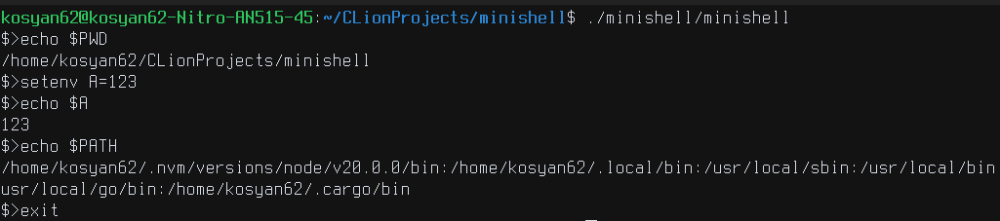

[](https://42.fr/)
[](https://github.com/kosyan62/minishell/actions/workflows/c-cpp.yml)




# Minishell

Minishell is a minimal Unix shell written in C, developed as part of the 42 School curriculum. This shell provides a basic command-line interface with support for running executable commands and handling a small set of built-in functions. The project emphasizes understanding of Unix process management, file descriptors, and environment handling.

## Project Overview

- **Language:** C
- **Executable:** `minishell`
- **Core topics:** 
  - Process creation, 
  - command execution, 
  - environment management, 
  - error handling
- [Original subject](static/en.subject-Minishell.pdf)

## Goals

The project aims to provide a foundational understanding of how a shell works in Unix-like operating systems:
- Build a simple shell interpreter
- Understand process creation using `fork` and `execve`
- Work with the environment and the `PATH` variable
- Handle command input/output and system-level errors gracefully
- Implement basic shell built-ins from scratch

## Features

### Mandatory
- Display a shell prompt (e.g. `$>`), read and execute commands
- Use `PATH` to locate executables or run absolute/relative paths
- Show error messages if a command cannot be found or executed
- Correctly handle and pass environment variables (`char **environ`)
- Implement the following built-in commands:
  - `echo`
  - `cd`
  - `setenv`
  - `unsetenv`
  - `env`
  - `exit`

### Not Supported (in mandatory part)
- Pipes (`|`)
- Redirections (`>`, `<`, `>>`)
- Logical operators (`&&`, `||`)
- Quoting and variable expansion
- Multiline input

## Allowed Functions

You are only allowed to use the following C functions for the mandatory part:

- Memory: `malloc`, `free`
- I/O: `open`, `close`, `read`, `write`
- Directory: `opendir`, `readdir`, `closedir`, `getcwd`, `chdir`
- File info: `stat`, `lstat`, `fstat`
- Process: `fork`, `execve`, `wait`, `waitpid`, `wait3`, `wait4`
- Signals: `signal`, `kill`
- Misc: `access`, `exit`

## Compilation

```bash
make
```

### Makefile Targets

| Target   | Description                      |
|----------|----------------------------------|
| `all`    | Build the minishell binary       |
| `clean`  | Remove object files              |
| `fclean` | Remove object files and binary   |
| `re`     | Rebuild the project              |

## Bonus Ideas

These features are not required but implemented for additional challenge:

- Signal handling (e.g. `Ctrl-C`)
- Empty $PATH handling
- Command separation using `;`

## License

Educational project for the 42 School curriculum.
